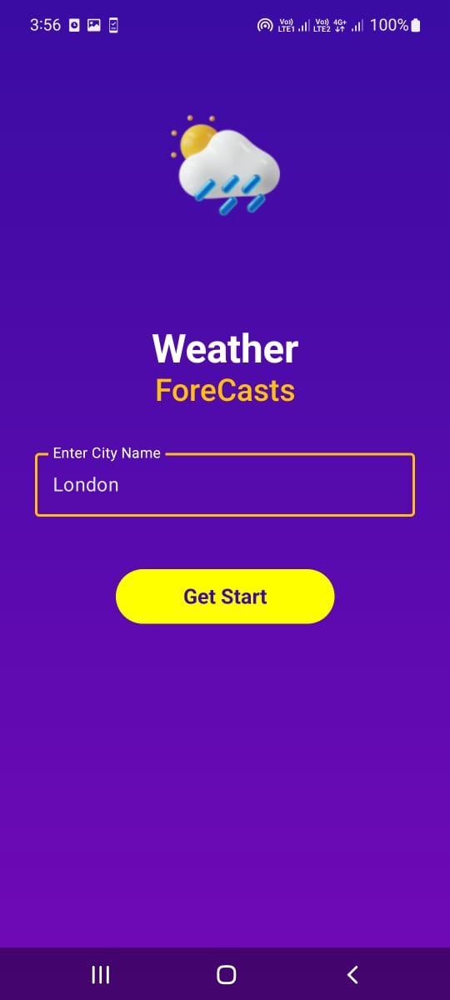
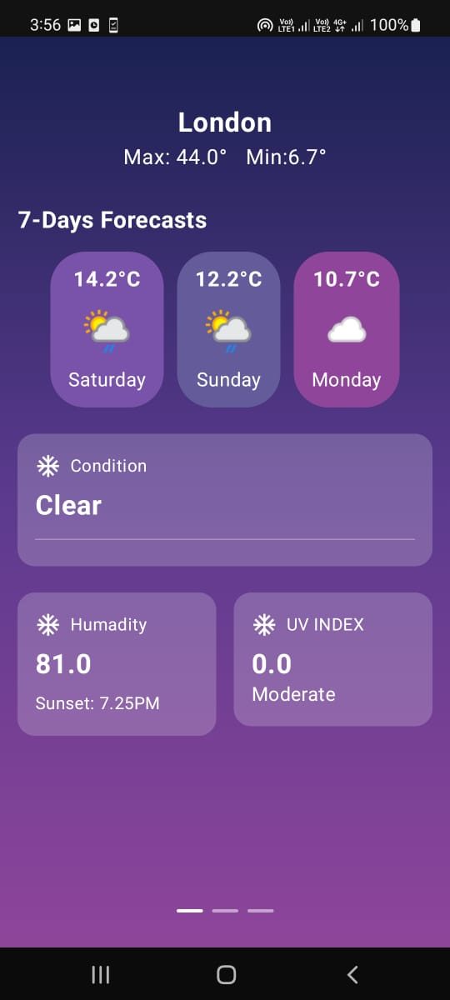

# 🌤 Weather Now & Later

A modular Android weather application built with **Jetpack Compose**, using **MVVM & MVI architecture**, and integrated with the **OpenWeatherMap API**.

## 📱 Features

- 🔍 Search for a city's current weather.
- 🌡 Display temperature, condition, and weather icon.
- 📅 7-day weather forecast using MVI.
- 💾 Remembers the last searched city.
- 📱 UI librar used

## 🛠 Architecture

This app follows **Clean Architecture** principles:

```
App
│
├── core             # Shared utilities and constants
├── data             # Repositories & Data sources (local + remote)
├── domain           # Use cases and interfaces
└── features
    ├── cityinput        # City input screen (MVVM)
    ├── currentweather   # Current weather display (MVVM)
    └── forecast         # 7-day forecast (MVI)
```

- **MVVM**: Used for City Input & Current Weather modules.
- **MVI**: Applied to Forecast module for state management.

## 🧪 Testing

- ✅ 80%+ unit test coverage.
- 🔧 Mocking via JUnit.
- 🔁 CI/CD: GitHub Actions pipeline runs lint, unit tests, and APK build , I used detekt locally as i am contributor for this library.

## 🧩 Libraries Used

- [Jetpack Compose](https://developer.android.com/jetpack/compose)
- [Dagger-Hilt](https://dagger.dev/hilt/)
- [Retrofit](https://square.github.io/retrofit/)
- [Kotlin Coroutines](https://kotlinlang.org/docs/coroutines-overview.html)
- [OpenWeatherMap API](https://openweathermap.org/api)
- [Timber](https://github.com/JakeWharton/timber) for logging


## 🧪 CI/CD

- **Lint Check**
- **Unit Tests**
- **Build APK**


## 📦 Custom Library

Included a custom utility library for:
- Formatting weather details
- Mapping weather condition codes to icons


## 🎨 UI Design

Based on this Figma file:  
[🌐 Figma: Weather App Community Design](https://www.figma.com/design/AMErddgDk19EIdum0xUtDz/Weather-app--Community-?node-id=0-1&p=f&t=5HePRWgWJHkKvIDA-0)

## 📷 Screenshots

| Search City                         | Current Weather                       | 7-Day Forecast                        |
|-------------------------------------|---------------------------------------|---------------------------------------|
|  |  |  |


---

## 📷 Video

